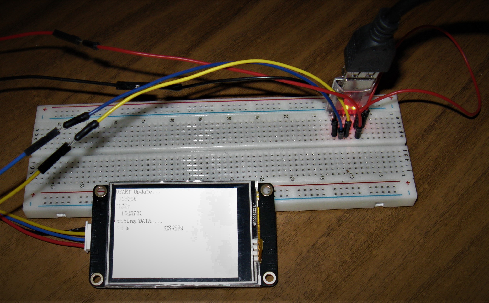
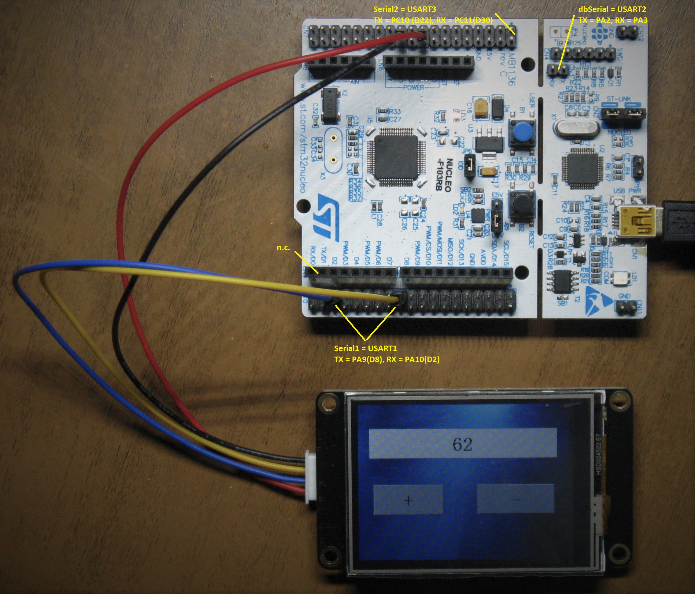

# NEXTION Display connect to STM32 Nucleo Board with Arduino IDE

**requirements:**

- STM32 [Nucleo Board](https://www.st.com/stm32nucleo)

- NEXTION [Display](https://nextion.itead.cc/)

- Arduino [IDE](https://www.arduino.cc/en/Main/Software)

- NEXTION [Editor](https://nextion.itead.cc/resources/download/nextion-editor/)

- Iteadlib Arduino Nextion [Library](https://github.com/itead/ITEADLIB_Arduino_Nextion)

- Board Manager [STM32 Cores](https://github.com/stm32duino/Arduino_Core_STM32) 

- Text Editor like [Geany](https://www.geany.org/)

If you have not, install all

**Works on files for STM32**

Before you can use all examples in the Nextion Library rename all Compxxx_v0_32.ino to Compxxx.ino, Arduino IDE can't deal with the old file name (e.g. CompText_v0_32.ino to CompText.ino)

Open with text editor NexConfig.h and change

​	#define nexSerial Serial2 	to 	#define nexSerial Serial1

Open with text editor NexUpload.cpp and comment out

​	#include <SoftwareSerial.h> 	to	//#include <SoftwareSerial.h> 

Open with text editor Compxxx.ino and write in a new line

​	HardwareSerial Serial1(PA10,PA9);

Open with Arduino IDE Compxxx.ino , compile and upload to STM32

**Works on file for display**

Open the file Compxxx_v0_32.HMI and choose your display.

If you get the message "Drawing off screen" your display is too small for the picture. Go to the picture icon, open with the right button of your mouse a menu and export this picture, resize it and replace the old one.

Upload it over a serial connection

or save the Compxxx_v0_32.tft from the bianyi folder on a memory SD card, put it in the memory SD card holder on the backside of the display, restart the display and upload will start automatically.

Where is the bianyi folder? It is deep buried in the labyrinth of user folders, before you can see it, you have to activate in windows "Show hidden files, folders, and drives"

C:\Users\username\AppData\Roaming\Nextion Editor\bianyi

Connect all as you see on the picture and restart it.

It should look like this. An example and all changed files are in the repo.

harebit